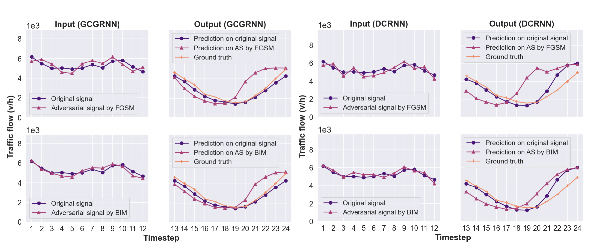

## Presentation

<iframe width="540" height="315" src="https://www.youtube.com/embed/{{ 9UMxZofMNbA }}" frameborder="0" allow="accelerometer; autoplay; encrypted-media; gyroscope; picture-in-picture" allowfullscreen></iframe>

## Abstract
Traffic state prediction is necessary for many Intelligent Transportation Systems applications. Recent developments of the topic have focused on network-wide, multi-step prediction, where state of the art performance is achieved via deep learning models, in particular, graph neural network-based models. While the prediction accuracy of deep learning models is high, these models' robustness has raised many safety concerns, given that imperceptible perturbations added to input can substantially degrade the model performance. In this work, we propose an adversarial attack framework by treating the prediction model as a black-box, i.e., assuming no knowledge of the model architecture, training data, and (hyper)parameters. However, we assume that the adversary can oracle the prediction model with any input and obtain corresponding output. Next, the adversary can train a substitute model using input-output pairs and generate adversarial signals based on the substitute model. To test the attack effectiveness, two state of the art, graph neural network-based models (GCGRNN and DCRNN) are examined. As a result, the adversary can degrade the target model's prediction accuracy up to 54%. In comparison, two conventional statistical models (linear regression and historical average) are also examined. While these two models do not produce high prediction accuracy, they are either influenced negligibly (less than 3%) or are immune to the adversary's attack.



-------
## Links
1. [Paper](https://arxiv.org/abs/2110.08712)
2. [Slides](https://github.com/stars-cs/black_box_traffic/blob/gh-pages/Black%20Box%20Adversarial%20Attacks.pdf)
3. [Video Presentation](https://github.com/stars-cs/black_box_traffic/blob/gh-pages/Black%20Box%20Adversarial%20Attacks.pdf)

-------
## Cite

```
@InProceedings{Poudel2021Attack,
  author = {Bibek Poudel and Weizi Li},
  title = {Black-box Adversarial Attacks on Network-wide Multi-step Traffic State Prediction Models},
  booktitle = {IEEE International Conference on Intelligent Transportation Systems},
  year = {2021},
}
```
-------
## Acknowledgements
The authors would like to thank the University of Memphis for providing the start-up fund.
